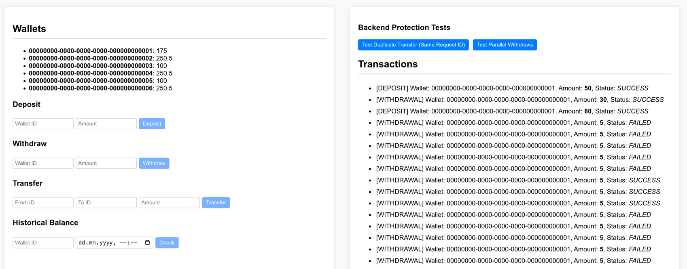

# WalletApp

#### При разработке старался соблюдать паттерны GRASP и принципы SOLID 

Интерфейс для управления кошельками, проведения транзакций и просмотра исторического баланса в определённый момент времени.

<!-- добавь скриншот интерфейса -->

---

## Функции

- Пополнение кошелька
- Списание средств
- Перевод между кошельками
- Просмотр всех транзакций
- Получение баланса кошелька на заданную дату/время
- Тестирование защиты от дублирующих запросов и параллельных операций

---

## 

```sql
CREATE TABLE wallets (
    id UUID PRIMARY KEY,
    balance DECIMAL(19,4) NOT NULL,
    created_at TIMESTAMP NOT NULL DEFAULT CURRENT_TIMESTAMP,
    updated_at TIMESTAMP NOT NULL DEFAULT CURRENT_TIMESTAMP,
    version BIGINT NOT NULL DEFAULT 0
);

CREATE TABLE transactions (
    id UUID PRIMARY KEY,
    wallet_id UUID NOT NULL,
    type VARCHAR(20) NOT NULL,
    amount DECIMAL(19,4) NOT NULL,
    balance_after_transaction DECIMAL(19,4) NOT NULL,
    status VARCHAR(20) NOT NULL DEFAULT 'PENDING',
    request_id UUID UNIQUE,
    created_at TIMESTAMP NOT NULL DEFAULT CURRENT_TIMESTAMP,
    updated_at TIMESTAMP NOT NULL DEFAULT CURRENT_TIMESTAMP,
    FOREIGN KEY (wallet_id) REFERENCES wallets(id)
);
```

``version`` используется для оптимистической блокировки. Если версия изменилась между чтением и записью - обновление отклоняется.

``request_id`` - идемпотентный идентификатор запроса - UUID, передаваемый клиентом. Позволяет защититься от дублирующих запросов.

``balance_after_transaction`` - снимок баланса кошелька после выполнения конкретной транзакции.

```markdown
src/
├── main/
│   ├── java/com.walletapp.project/
│   │   ├── config/                  # Конфигурационные классы. Разрешаем cors для фронта + TypeHandlerUUID для MyBatis
│   │   ├── controller/              # REST-контроллеры для работы с кошельками и транзакциями
│   │   ├── dto/                     # Data Transfer Objects
│   │   ├── enums/                   # Перечисления: тип транзакции, статус
│   │   ├── exception/               # Кастомные исключения и обработка ошибок
│   │   ├── mapper/                  # DTO мапперы (EntityToDto)
│   │   ├── model/                   # Модели: Transaction, Wallet
│   │   ├── repository/              # Обёртки над мапперами + работа с базой
│   │   │   └── mappers/             # SQL-мапперы MyBatis
│   │   ├── service/                 
│   │   │   ├── impl/                # Реализация бизнес-логики
│   │   ├── validator/               # Валидация  
│   │   └── ProjectApplication      
│   └── resources/
│       ├── application.properties   # Конфигурация Spring Boot
│       └── schema.sql               # SQL-скрипт создания таблиц
├── test/                            # Unit tests
```

#### Класс IsolatedTransactionWriterImpl был создан для вынесения записи и обновления транзакций в отдельные, изолированные транзакции — вне зависимости от основного бизнес-потока
Зачем это понадобилось:

Изоляция изменений: при любом сбое в основной транзакции (например, при обновлении баланса кошелька) запись о попытке транзакции (например, со статусом PENDING/FAILED) всё равно сохраняется в БД. Нужно для ведения прозрачного и полного журнала операций.